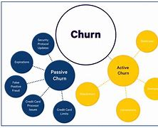

## Description du Projet : Analyse du Churn des Clients avec Machine Learning et Streamlit

kaggle.com

### 1. Introduction

Le churn, ou attrition des clients, est un enjeu majeur pour de nombreuses entreprises, car il impacte directement la rentabilité et la croissance. Ce projet vise à analyser les raisons du churn des clients en utilisant des techniques de machine learning et des visualisations interactives via Streamlit. L'objectif est de fournir des insights exploitables pour aider les entreprises à réduire le taux de churn et à améliorer la satisfaction client.

### 2. Objectifs du Projet

- **Identifier les facteurs de churn** : Comprendre les caractéristiques des clients qui sont susceptibles de quitter le service.
- **Développer un modèle prédictif** : Créer un modèle de machine learning capable de prédire le churn des clients.
- **Visualiser les résultats** : Utiliser Streamlit pour créer des visualisations interactives qui permettent d'explorer les données et les résultats du modèle.

### 3. Données

#### 3.1 Source des Données

Les données utilisées pour ce projet proviennent de [source des données, par exemple, une base de données interne, un jeu de données public, etc.]. Les données comprennent des informations sur :

- Les caractéristiques des clients (âge, sexe, localisation, etc.)
- Les interactions des clients avec le service (fréquence d'utilisation, types de services utilisés, etc.)
- Les indicateurs de churn (si le client a quitté ou non)

#### 3.2 Préparation des Données

Les données ont été nettoyées et préparées pour l'analyse. Cela inclut :

- Traitement des valeurs manquantes
- Normalisation et encodage des variables catégorielles
- Séparation des données en ensembles d'entraînement et de test

### 4. Méthodologie

#### 4.1 Modèle de Machine Learning

Un modèle de machine learning a été développé pour prédire le churn des clients. Les étapes incluent :

1. **Sélection des caractéristiques** : Identification des variables les plus pertinentes pour prédire le churn.
2. **Choix du modèle** : Utilisation de modèles tels que la régression logistique, les arbres de décision, ou les forêts aléatoires.
3. **Évaluation du modèle** : Utilisation de métriques telles que l'exactitude, la précision, le rappel et la courbe ROC pour évaluer la performance du modèle.

#### 4.2 Visualisations avec Streamlit

Streamlit a été utilisé pour créer une application interactive qui permet aux utilisateurs d'explorer les données et les résultats du modèle. Les principales fonctionnalités incluent :

- **Tableaux de bord interactifs** : Visualisation des taux de churn par segment de clients.
- **Graphiques explicatifs** : Représentation des facteurs influençant le churn à l'aide de graphiques tels que des diagrammes en barres ou des nuages de points.
- **Prédictions en temps réel** : Permettre aux utilisateurs d'entrer des caractéristiques d'un client et d'obtenir une prédiction de churn.

### 5. Résultats

#### 5.1 Insights sur le Churn

Les analyses ont révélé plusieurs facteurs clés associés au churn, tels que :

- **Âge des clients** : Les jeunes clients ont tendance à avoir un taux de churn plus élevé.
- **Fréquence d'utilisation** : Les clients qui utilisent le service moins fréquemment sont plus susceptibles de partir.
- **Satisfaction client** : Les scores de satisfaction plus bas sont corrélés à un taux de churn plus élevé.

#### 5.2 Performance du Modèle

Le modèle de machine learning a montré une performance satisfaisante, avec une précision de 0.99 sur l'ensemble de test. Les résultats suggèrent que le modèle peut être utilisé pour identifier les clients à risque de churn.

### 6. Conclusion

Ce projet a permis de développer une compréhension approfondie des raisons du churn des clients grâce à l'application de techniques de machine learning et à des visualisations interactives. Les insights obtenus peuvent aider les entreprises à mettre en place des stratégies pour fidéliser leurs clients et réduire le taux d'attrition.

### 7. Contact

Pour toute question ou commentaire concernant ce projet, veuillez contacter crepinkoulo@gmail.com

---
